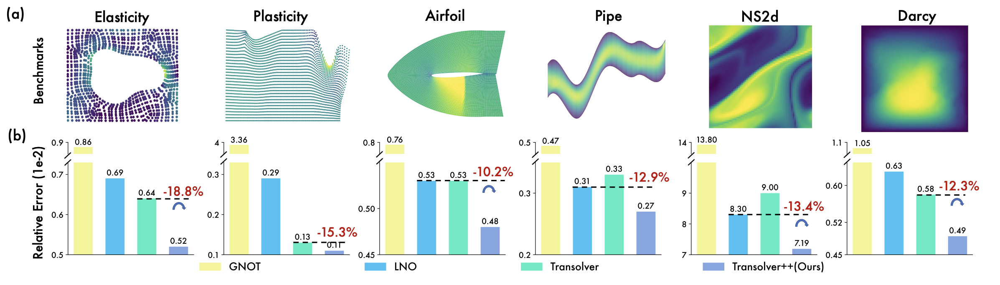
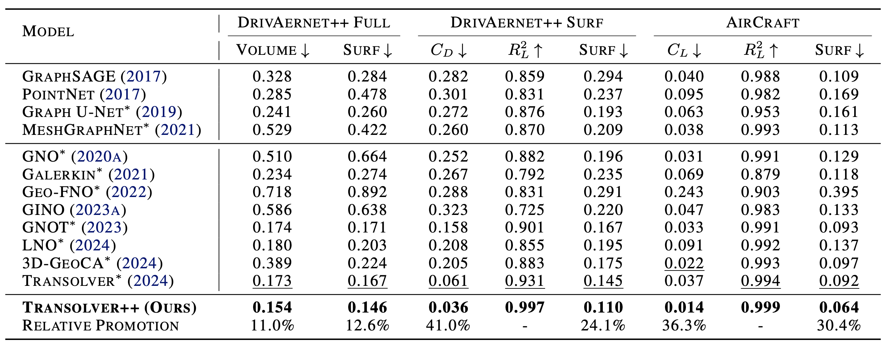

# Transolver++ (ICML 2025)

Transolver++: An Accurate Neural Solver for PDEs on Million-Scale Geometries. [[Paper]](https://arxiv.org/pdf/2502.02414)

Although previous works have made some progress in handling complex geometries and attempted to speed up model efficiency, they are still far from real applications, especially in handling large geometries. Here, we propose Transolver++ with following contributions:

* We introduce Transolver++ with **eidetic states**, which can adaptively aggregate information from massive mesh points to distinguishable physical states.
* We present an efficient and highly parallel implementation of Transolver++ with **linear scalability** and **minimal** overhead across GPUs.
* Transolver++ achieves a **13%** relative gain averaged from six standard benchmarks and over **20%** improvement on high-fidelity million-scale industrial datasets.

# Get Started from AirCraft dataset
1. Download the data from [link](https://drive.google.com/file/d/1UDGgtOM8UYBFbDe_t2FP7Ij9N5SA3w-g/view?usp=drive_link).

2. Change the `data_path` in the scripts and the mode of training or evaluation.

3. Directly run `scripts/transolver_plus.sh`


# Results
We extensively evaluate Transolver++ on six standard benchmarks and two industrial-level datasets with million-scale meshes, covering both physics and design-oriented metrics.
<figure>

<center>Fig 1. Results of standard benchmarks.</center>
</figure>

<figure>

<center>Fig 2. Results of industrial application tasks.</center>
</figure>

# Citation

If you find this repo useful, please cite our paper.

```tex
@inproceedings{luotransolver++,
  title={Transolver++: An Accurate Neural Solver for PDEs on Million-Scale Geometries},
  author={Luo, Huakun and Wu, Haixu and Zhou, Hang and Xing, Lanxiang and Di, Yichen and Wang, Jianmin and Long, Mingsheng},
  booktitle={Forty-second International Conference on Machine Learning}
}
```

# Contact

If you have any questions of the code, please contact luohk24@mails.tsinghua.edu.cn
